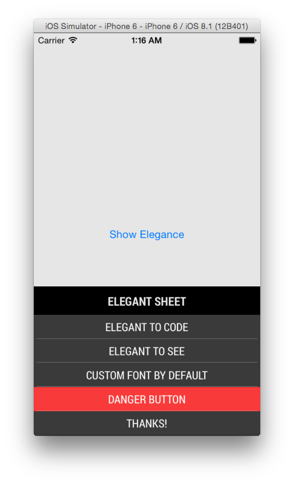
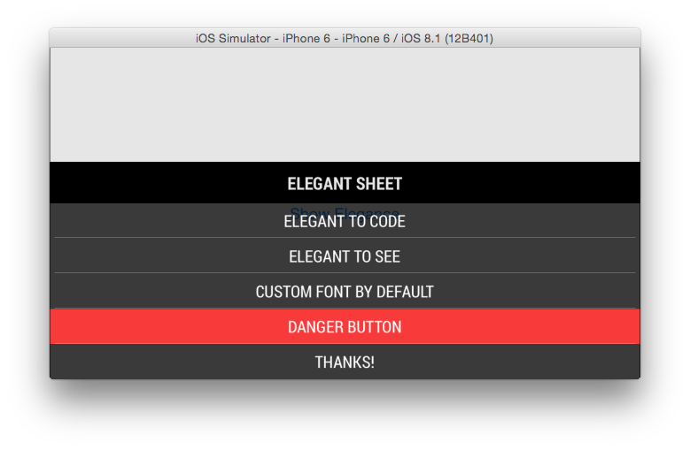

# IAElegantSheet 
[](https://travis-ci.org/ixnixnixn/IAElegantSheet)
[](http://cocoapods.org/?q=iaelegantsheet)
[](https://coveralls.io/r/ixnixnixn/IAElegantSheet?branch=master)

Another UIActionSheet but more elegant. Elegant to code and elegant to see. Using Roboto Condensed as default font.

## Urgh, another block based UIActionSheet?

Yes! :) We can't just get enough of block based handler are we.

I've built it for my latest/current project, and I built it also to learn on how to built action sheet using block handlers. It also uses Roboto Condensed as the default font. Also, support adapting portrait and landscape orientation thorugh auto layout.

## Preview



## Requirements

iOS 7.0 and above


## Usage

Import the header, create sheet, add buttons, add handler and show it :

````objc
#import "IAElegantSheet.h"

IAElegantSheet *elegantSheet = [IAElegantSheet elegantSheetWithTitle:@"Elegant Sheet"];

// add buttons with its own block
[elegantSheet addButtonsWithTitle:@"Elegant to code" block:^{
	code.isElegant = YES;
}];
[elegantSheet addButtonsWithTitle:@"Elegant to see" block:^{
	sheet.isElegant = YES;
}];
[elegantSheet addButtonsWithTitle:@"Custom font by default" block:^{
	NSString *defaultFont = @"Roboto";
}];

// set destructive red button with its block
[elegantSheet setDestructiveButtonWithTitle:@"Danger Button" block:^{
	[self doSomethingDangerous];
}];

// set cancel title (optional for block handle)
[elegantSheet setCancelButtonWithTitle:@"Thanks!" block:nil];
[elegantSheet showInView:self.view];
````

## [License](LICENSE)

Copyright (c) 2013-2015 Ikhsan Assaat. 

IAElegantSheet is provided under the MIT license.

## Attribution

Created as part of the Objective-C Hackathon on June 29th, 2013.
